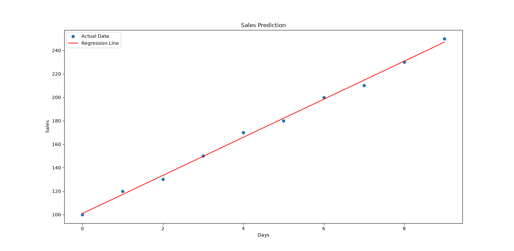

# Predictive Analytics Using Historical Data

## 📌 Project Overview

This project uses historical sales data to predict future sales using **Linear Regression**. The model analyzes the sales trend over time and estimates sales for the next 5 days.

## 🎯 Objective

The main objective of this project is to:

- Analyze historical sales data
- Identify the sales trend
- Build a Linear Regression model
- Predict sales for the next 5 days
- Visualize actual sales and the regression trend

## 🛠️ Technologies Used

- Python
- Pandas
- NumPy
- Matplotlib
- Scikit-learn

## 📊 Dataset

The dataset contains daily sales information from January 1, 2024 to January 10, 2024.

### Columns

- **Date** – Date of the sales record
- **Sales** – Daily sales value

## 🔍 Methodology

1. Loaded the historical sales dataset.
2. Converted the Date column into datetime format.
3. Created a numeric Day feature for the model.
4. Defined Day as the input feature and Sales as the target variable.
5. Trained a Linear Regression model.
6. Predicted sales for the next 5 days.
7. Visualized the actual sales values and regression line.

## 📈 Future Sales Predictions

| Day | Predicted Sales |
|-----|----------------:|
| Day 11 | 263.33 |
| Day 12 | 279.58 |
| Day 13 | 295.82 |
| Day 14 | 312.06 |
| Day 15 | 328.30 |

## 📷 Output

The graph shows the historical sales data along with the Linear Regression trend line.



## 💡 Key Insight

The historical data shows an increasing sales trend. Based on this trend, the Linear Regression model estimates that sales may continue to increase over the next 5 days.

> Note: These predictions are estimates based on a simple linear trend and a small historical dataset. Actual future sales may vary.

## 📁 Project Structure

```text
Predictive Analytics Using Historical Data/
│
├── main.py
├── sales_data.csv
├── Sales_Prediction.png
└── README.md